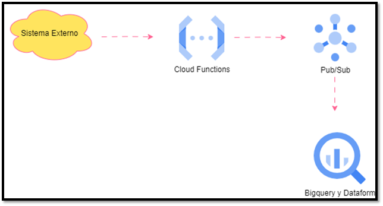
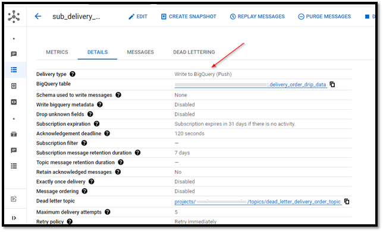
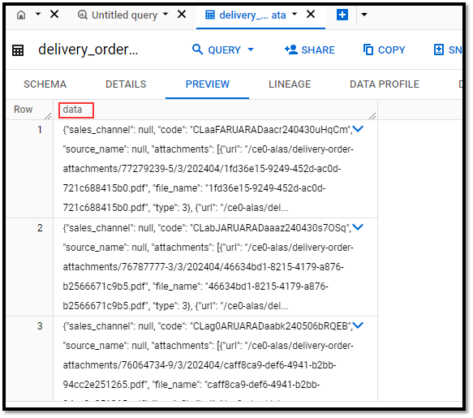

## Documentation of the Data Transformation Process in GCP Using a Pure ELT Approach

This document details the implementation of a real-time order processing system using an ELT approach on the Google Cloud Platform (GCP), characterized by streaming information going directly into a data warehouse without intermediate transformation. The system improves efficiency and reduces costs by minimizing GCP services to Pub/Sub, BigQuery, and Dataform. This documentation focuses on data extraction, the loading and transformation process, and the automation of data pipelines for business analysis.

### Introduction
The need to process large volumes of order data in real time led us to evaluate and migrate from a traditional ETL approach to a more flexible and scalable ELT approach. This change allows data manipulation directly in our data warehouse, BigQuery, optimizing costs and processing time.

### System Architecture
The designed architecture focuses on the ingestion of real-time order events, but without initial cleaning and intermediate transformation processing, directly deriving the data as it arrives in BigQuery for more complex transformations and future analysis.

### 2.1 Data Flow
Extraction: Orders are captured and sent in JSON format each time they change status.
Pub/Sub: A Cloud function receives the orders and publishes them in a Pub/Sub topic designed for real-time event ingestion.
BigQuery and Dataform: Within BigQuery, Dataform scripts are used for additional transformations, data structuring, and preparation for business analysis.
### 2.2 Architecture Diagram
 

### Component Details
### 3.1 Google Cloud Pub/Sub
Google Cloud Pub/Sub is used for decoupling data producer services from consumers. This approach ensures scalable and reliable message processing. A specific topic for orders was configured, where each status change is published in real-time by a Cloud Functions.

The detail in this case is that Pub/Sub has a **Write to BigQuery** type subscription that precisely allows the message that arrives to be transmitted directly to an existing table in BigQuery. Thus, the information arrives in real time to the Datawarehouse, albeit in raw form. The data is ingested into a field called “data” of the existing table.

 

 

Subsequently, through Dataform, a SQL pipeline is deployed that allows transformations that were previously done with Dataflow, making it ready for later analysis and saving significant costs.

### 3.2 BigQuery and Dataform
Once in BigQuery, we use Dataform to manage complex transformations and data preparation for analysis. Dataform allows defining and automating SQL data transformation workflows, facilitating task orchestration and dependency management. Moreover, its integration with version control systems like Git enables efficient collaboration and tracking changes in transformation scripts.

### Dataform Scheduling
Dataform scripts are scheduled to run every 10 minutes, using time-based triggers. This frequency ensures that the data is consistently updated and ready for analysis. The setup is done through the Dataform interface, specifying the branch of the Git repository to use, which allows continuous integration and continuous delivery (CI/CD) of changes in the transformation scripts.

### Conclusions
The implementation of this Pure ELT system in GCP has allowed for more efficient and cost-effective data processing. The designed architecture ensures that the data is available and updated for analysis, supporting real-time business decision-making. This project highlights the versatility and power of GCP tools to address complex data engineering challenges.
